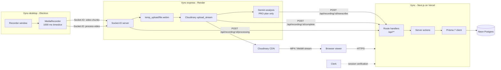
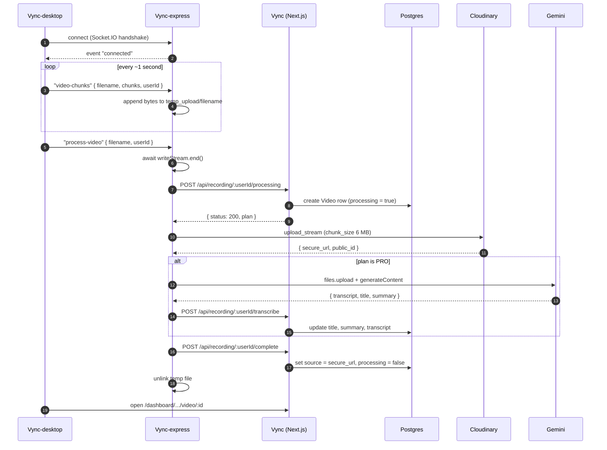
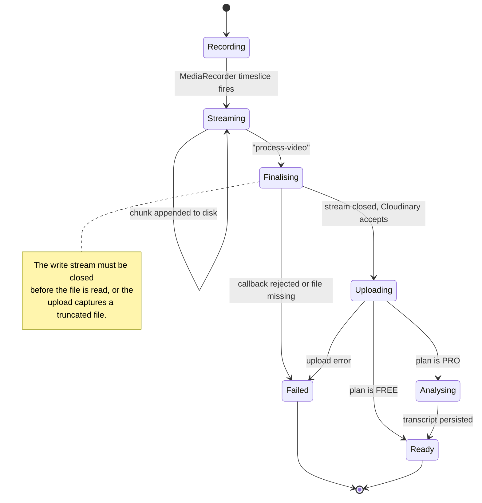
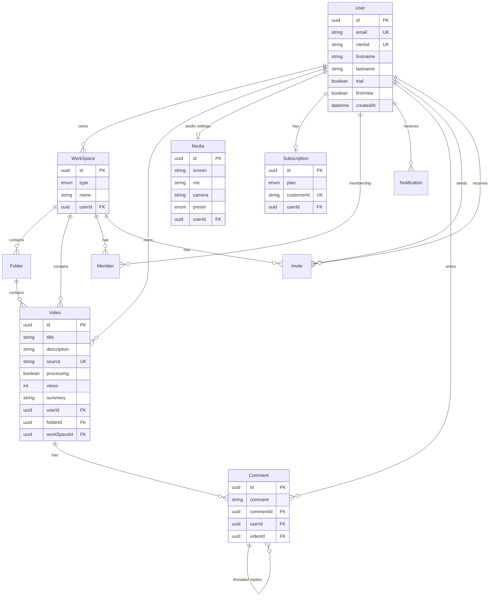
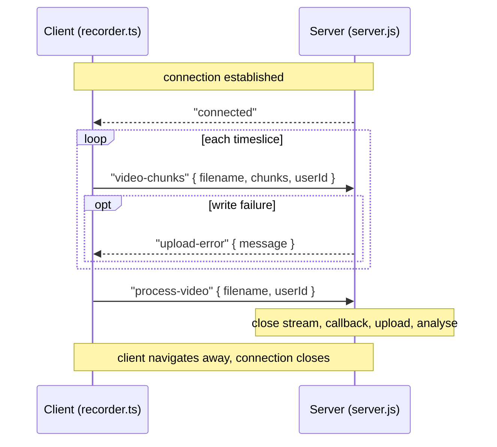
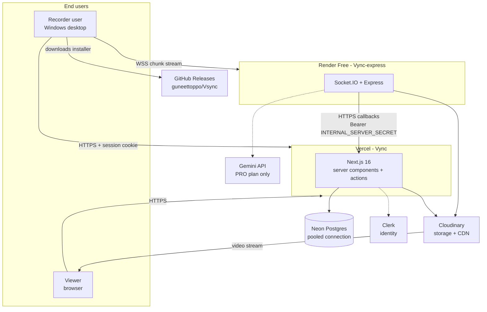
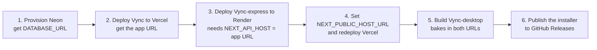

<!-- ============================================================
     Vync - README (part A: overview, architecture, getting started)
     ============================================================ -->

# Vync

**Screen recording that uploads while you record.**

Stream chunks off the machine the moment they are produced, assemble them server-side, and hand back a shareable link. No waiting for a five minute export, no losing the take if the tab closes at minute four.


> [!NOTE]
> This repository is a monorepo of three independently deployable applications. If you only want to run one of them, jump straight to [Getting Started](#getting-started) and ignore the other two.

---

## Table of contents

- [What Vync does](#what-vync-does)
- [Why the upload model matters](#why-the-upload-model-matters)
- [Architecture at a glance](#architecture-at-a-glance)
- [The recording lifecycle](#the-recording-lifecycle)
- [Data model](#data-model)
- [Repository structure](#repository-structure)
- [Technology choices](#technology-choices)
- [Getting started](#getting-started)
- [Environment variables](#environment-variables)
- [API surface](#api-surface)
- [Real-time contract](#real-time-contract)
- [Deployment](#deployment)
- [Known limitations](#known-limitations)
- [Troubleshooting](#troubleshooting)
- [Further documentation](#further-documentation)

---

## What Vync does

| Capability | Description |
|---|---|
| **Screen recording** | Capture a full screen or a single window from a native Windows client, with microphone audio. |
| **Streaming upload** | Encoded video leaves the machine every second instead of at the end of the recording. |
| **Workspaces** | Organise videos into personal or shared workspaces, with folders nested inside them. |
| **Sharing** | Every video has a public preview link. Copy it, send it, the recipient watches without an account. |
| **Collaboration** | Invite people to a workspace by email, leave comments, reply in threads. |
| **AI enrichment** | On paid plans, a transcript, generated title and summary are produced automatically. |
| **Library management** | Search, rename, move between folders, delete, and track view counts. |
| **Notifications** | In-app notifications for invites and workspace activity. |
| **Desktop distribution** | The recorder ships as a signed installer with auto-update against GitHub Releases. |

### The five surfaces

1. **Marketing and auth** at `/`, with sign-in and sign-up routed through Clerk.
2. **Dashboard** at `/dashboard/[workspaceId]`, containing the video library, folders, notifications, billing and settings.
3. **Player and comments** at `/dashboard/[workspaceId]/video/[videoId]`.
4. **Public preview** at `/preview/[videoId]`, readable without a session.
5. **Desktop recorder**, an Electron application that owns capture, the camera overlay, and the tray controls.

---

## Why the upload model matters

Most tutorial-grade screen recorders buffer the whole recording in the browser, then upload it as one request when the user stops. That design has four problems that only appear once recordings get long:

| Problem | Consequence at ten minutes |
|---|---|
| The entire recording lives in memory | Several hundred megabytes held by a tab that can be closed at any time |
| Nothing is durable until the end | A crash at minute nine loses nine minutes |
| One long request | Intermediaries time out, and progress cannot be reported honestly |
| No early media processing | The server cannot start transcoding until the last byte arrives |

Vync takes the other approach. `MediaRecorder.start(1000)` emits roughly one second of encoded video per callback, each chunk is written to the ingestion service as it is produced, and the file on the server grows while the recording continues. The tradeoff is that ordering and completeness become the application's responsibility rather than the transport's, which is the central design tension of the whole project.

---

## Architecture at a glance



### The three applications

| Application | Runtime | Responsibility | Deployed to |
|---|---|---|---|
| `Vync-desktop` | Electron 30 + Vite + React 18 | Capture, encode, stream chunks, camera overlay, auto-update | GitHub Releases (NSIS installer) |
| `Vync-express` | Node 22 + Express 5 + Socket.IO 4 | Receive chunks, assemble the file, upload to media storage, run AI analysis | Render (free web service) |
| `Vync` | Next.js 16 + React 19 | Identity, data, dashboard, player, public preview, callbacks | Vercel |

### Why three processes and not one

| Decision | Reason |
|---|---|
| Ingestion is separate from the web app | It needs a long-lived process with a writable disk, which a serverless function cannot provide. |
| The desktop client is separate | Web pages cannot enumerate windows or capture system audio reliably, and the recorder needs to float above other windows. |
| The web app owns all identity | One place decides who a user is, so the ingestion service never has to trust a client assertion. |

> [!IMPORTANT]
> The ingestion service and the web app share no session state. They communicate over HTTP callbacks authenticated by a single shared secret, which means **that secret must be byte-identical on Vercel and Render**. A single trailing newline difference stops every recording from ever leaving the processing state.

---

## The recording lifecycle



### Video lifecycle



> [!TIP]
> The `processing` column is the only progress indicator in the data model. It is a boolean, so it can express "still working" and "done" but not *which stage* or *how long it has been stuck*. See [Known limitations](#known-limitations).

---

## Data model

Ten models, three enums. Identity is mirrored from Clerk into the `User` table on first sight, and every other model hangs off that.



| Model | Purpose | Notes |
|---|---|---|
| `User` | Mirrored Clerk identity | `clerkid` is the join key to Clerk; `email` and `clerkid` are unique |
| `WorkSpace` | Top-level container | `type` is `PERSONAL` or `PUBLIC` |
| `Folder` | Optional grouping inside a workspace | Defaults to `"Untitled Folder"` |
| `Video` | The recording | `source` holds the delivery URL and is unique; `processing` gates the dashboard spinner |
| `Comment` | Threaded comments | Self-relation via `commentId` for replies |
| `Member` | Workspace membership | Distinct from ownership |
| `Invite` | Pending email invitation | Two relations to `User` (`sender` and `reciever`), so both need named relations |
| `Subscription` | Plan state | `PRO` or `FREE`; `customerId` reserved for Stripe |
| `Media` | Per-user capture settings | One-to-one with `User`; stores chosen screen, mic, camera and preset |
| `Notification` | In-app notifications | Carries optional deep `link` |

> [!NOTE]
> Foreign keys are declared but not indexed. Postgres creates an index for primary keys and unique constraints, not for foreign keys, so every workspace listing currently performs a sequential scan. This is the highest value-per-line fix in the repository. See [Known limitations](#known-limitations).

---

## Repository structure

```
Vync-main/
├── Vync/                        # Next.js 16 web application
│   ├── prisma/
│   │   ├── schema.prisma        # 10 models, 3 enums
│   │   └── init.sql             # generated DDL (offline migration path)
│   ├── src/
│   │   ├── app/
│   │   │   ├── (website)/       # marketing + landing
│   │   │   ├── auth/            # Clerk sign-in, sign-up, callback
│   │   │   ├── dashboard/[workspaceId]/
│   │   │   │   ├── home/        # video library
│   │   │   │   ├── folder/[folderId]/
│   │   │   │   ├── video/[videoId]/
│   │   │   │   ├── notifications/
│   │   │   │   ├── settings/
│   │   │   │   └── billing/
│   │   │   ├── preview/[videoId]/     # public, no session required
│   │   │   └── api/                   # route handlers (callbacks + auth)
│   │   ├── actions/             # server actions: user.ts, workspace.ts
│   │   ├── components/          # global/, forms/, ui/, icons/, theme/
│   │   ├── lib/                 # prisma.ts, utils.ts
│   │   ├── react-query/         # prefetch + hydration helpers
│   │   ├── redux/               # client-side slices
│   │   └── generated/prisma/    # generated client (not committed)
│   └── .env.example
│
├── Vync-express/                # Node 22 + Socket.IO ingestion service
│   ├── server.js                # the entire service, 311 lines
│   ├── temp_upload/             # transient chunks, ephemoral on Render
│   └── .env.example
│
├── Vync-desktop/                # Electron 30 recorder
│   ├── electron/
│   │   ├── main.ts              # windows, IPC, local file server, auto-update
│   │   └── preload.ts           # contextBridge surface
│   ├── src/
│   │   ├── studio_main.tsx      # recording UI entry
│   │   ├── webcam_main.tsx      # camera overlay entry
│   │   ├── layouts/ControlLayer.tsx
│   │   ├── hooks/               # useMediaSources, useStudioSettings
│   │   ├── lib/recorder.ts      # socket + MediaRecorder wiring
│   │   └── schemas/
│   ├── release/                 # build output (gitignored)
│   └── .env.example
│
├── docs/
│   ├── vync-system-design/      # 109 page engineering review + printed PDF
│   └── vync-learning-guide/     # 81 page guided build + printed PDF
├── render.yaml                  # Render blueprint for Vync-express
└── package.json                 # vestigial root manifest (see Troubleshooting)
```

> [!WARNING]
> The root `package.json` is a leftover scaffold whose `name` field is still the unsubstituted literal `${PROJECT_NAME}`. It is invalid per npm's naming rules, and because package managers walk up the directory tree looking for a workspace root, it breaks installs that start inside `Vync/` or `Vync-express/`. Always scope installs and builds to the subdirectory. See [Troubleshooting](#troubleshooting).

---

## Technology choices

### Web application (`Vync`)

| Technology | Version | Why this one |
|---|---|---|
| Next.js | 16.2.7 | App Router gives server components, server actions and route handlers in one deployment unit; the dashboard is data-heavy and mostly server-rendered. |
| React | 19.2.4 | Required by Next 16. Server components keep the client bundle small. |
| Prisma | 7.8.0 | Typed schema and generated client; nested writes suit workspace creation and folder moves. |
| `@prisma/adapter-pg` | 7.8.0 | Prisma 7 requires an explicit driver adapter; this routes the runtime through Node's `pg`, which also sidesteps the CLI's IPv6 behaviour. |
| Clerk | 7.4.3 | Sessions, sign-in UI, and a token the desktop client can also use. |
| TanStack Query | 5.101 | Server-side prefetch, then `HydrationBoundary` so the first client render has data and shows no spinner. |
| Redux Toolkit | 2.12 | Client-only UI state that outlives a route change, such as the studio settings panel. |
| Zod | 3.25 | Form and action input validation. |
| Tailwind CSS | 4.x | Utility styling with a shadcn-style component layer. |
| Cloudinary | 2.10 | Media storage, transcoding and CDN delivery in one integration. |
| Nodemailer | 8.0 | Invitation emails over Gmail SMTP with an app password. |

### Ingestion service (`Vync-express`)

| Technology | Version | Why this one |
|---|---|---|
| Express | 5.2.1 | Hosts the Socket.IO server on an HTTP server, plus one health route. |
| Socket.IO | 4.8.3 | Reconnection, rooms, acknowledgements and binary framing without writing them by hand. |
| Cloudinary SDK | 2.10 | `upload_stream` pipes a read stream to media storage without buffering the file. |
| `@google/genai` | 2.9 | Gemini file upload, polling and structured JSON generation. |
| Axios | 1.18 | The three HTTP callbacks back into the web application. |
| Zod | 4.4 | Payload validation for socket events. |

### Desktop client (`Vync-desktop`)

| Technology | Version | Why this one |
|---|---|---|
| Electron | 30.5.1 | Native window enumeration, system audio capture, always-on-top overlays. |
| Vite | 5.1 | Fast renderer builds for the three separate windows. |
| `vite-plugin-electron` | 0.28 | Builds main, preload and renderer from one config. |
| electron-builder | 24.13 | NSIS installer generation and GitHub Releases publishing. |
| `electron-updater` | 6.8 | Auto-update driven by a `latest.yml` manifest on the release. |
| Clerk React | 6.9 | The desktop client shares the web app's Clerk instance, so one account works in both. |
| React | 18.2 | The recorder UI; media APIs are better supported on 18 in this setup. |

---

## Getting started

### Prerequisites

| Requirement | Version | Needed for |
|---|---|---|
| Node.js | 22.x | All three applications (Next 16 requires ≥ 20.9; Express declares `22.x`) |
| npm | 10 or newer | Dependency installation (lockfile-based `npm ci` is used on CI) |
| A Postgres database | 14+ | The web application. A free Neon project is enough. |
| A Clerk application | - | Authentication, in both the web app and the desktop client |
| A Cloudinary account | - | Media storage and delivery |
| Git | any | Cloning |
| Windows | 10 or 11 | Building the desktop installer (the target is NSIS) |

> [!TIP]
> You do not need all of this to look at one application. The web app needs Postgres, Clerk and Cloudinary. The ingestion service needs Cloudinary, and a running web app to call back into. The desktop client needs both of the others and a Clerk key.

---

### 1. Clone

```bash
git clone https://github.com/guneettoppo/Vsync.git
cd Vsync
```

---

### 2. Web application (`Vync`)

```bash
cd Vync
npm install
cp .env.example .env          # then fill in the values, see the table below
npx prisma generate           # writes the typed client to src/generated/prisma
npx prisma db push            # or: npx prisma migrate deploy, for a versioned schema
npm run dev                   # http://localhost:3000
```

The `build` script runs `prisma generate && next build`, so the client is always regenerated before compilation.

> [!IMPORTANT]
> `prisma.config.ts` does not load `.env` automatically in Prisma 7. It imports `dotenv/config` explicitly, which means `dotenv` must be installed (it is a devDependency) and the `.env` file must sit next to `prisma.config.ts`.

<details>
<summary><b>If <code>prisma db push</code> reports P1001 that it cannot reach the database</b></summary>

<br/>

The cause is usually a broken IPv6 route rather than a closed port. Prisma's schema engine tries one address at a time, while Node's `pg` driver races them and takes whichever answers first, which is why the application connects while the CLI does not.

Two workarounds:

```bash
# Option A: generate the DDL offline, then apply it with a driver that works
npx prisma migrate diff --from-empty --to-schema prisma/schema.prisma --script -o prisma/init.sql
node -e "const fs=require('fs'),{Client}=require('pg');require('dotenv').config();\
const c=new Client({connectionString:process.env.DATABASE_URL});\
c.connect().then(()=>c.query(fs.readFileSync('prisma/init.sql','utf8'))).then(()=>c.end());"

# Option B: run the command from a network with a working IPv6 route
```

</details>

---

### 3. Ingestion service (`Vync-express`)

```bash
cd ../Vync-express
npm install
cp .env.example .env          # INTERNAL_SERVER_SECRET must match the web app exactly
npm run dev                   # nodemon server.js, listening on PORT (default 5000)
```

Verify it is alive before wiring anything to it:

```bash
curl http://localhost:5000/health
# {"status":"ok","uptimeSeconds":12,"sockets":0}
```

> [!WARNING]
> The server calls `process.exit(1)` at boot when `INTERNAL_SERVER_SECRET` is missing. That is deliberate: an ingestion service without the callback secret cannot complete a single recording, so failing loudly is better than failing at minute five of a user's take.

`GET /` returns 404 by design. `/health` is the only HTTP route; everything else is Socket.IO.

---

### 4. Desktop client (`Vync-desktop`)

```bash
cd ../Vync-desktop
npm install
cp .env.example .env          # VITE_* values are baked in at build time
npm run dev                   # Vite + Electron in development
npm run build                 # tsc && vite build && electron-builder
```

The installer is written to `release/`. For a quick manual test without installing, run the unpacked build directly:

```bash
./release/win-unpacked/Vync.exe
```

> [!NOTE]
> `VITE_*` variables are inlined into the renderer bundle during `vite build`. Editing `.env` after a build changes nothing; rebuild to pick up new values. This is why the desktop client should be built **last**, once the web and ingestion URLs are known.

---

## Environment variables

Three separate sets. Nothing is shared between them except `INTERNAL_SERVER_SECRET`, which must match exactly on both sides.

### Web application (`Vync`, set on Vercel)

| Variable | Required | Purpose and gotchas |
|---|---|---|
| `DATABASE_URL` | Yes | Neon **pooled** connection string (host contains `-pooler`), with `sslmode=require`. |
| `NEXT_PUBLIC_CLERK_PUBLISHABLE_KEY` | Yes | From the Clerk dashboard. Public by design. |
| `CLERK_SECRET_KEY` | Yes | Server-side Clerk key. Never expose it. |
| `NEXT_PUBLIC_CLERK_SIGN_IN_URL` | No | `/auth/sign-in`, to keep users on your own auth pages. |
| `NEXT_PUBLIC_CLERK_SIGN_UP_URL` | No | `/auth/sign-up`. |
| `NEXT_PUBLIC_CLERK_SIGN_IN_FALLBACK_REDIRECT_URL` | No | `/dashboard`. |
| `NEXT_PUBLIC_HOST_URL` | Yes | Public base URL for share links and invite emails. **No trailing slash.** |
| `INTERNAL_SERVER_SECRET` | Yes | Shared secret the ingestion service presents on every callback. 32+ random characters. |
| `NEXT_PUBLIC_CLOUDINARY_CLOUD_NAME` | Yes | Cloud name. Note the `NEXT_PUBLIC_` prefix here. |
| `CLOUDINARY_API_KEY` | Yes | Server-side key. |
| `CLOUDINARY_API_SECRET` | Yes | Server-side secret. |
| `MAILER_EMAIL` | Yes | Gmail address used to send invitations. |
| `MAILER_PASSWORD` | Yes | Google **app password** (2FA required). Remove the spaces; a normal account password will fail. |
| `NEXT_PUBLIC_CLOUD_FRONT_STREAM_URL` | No | Base URL for rich-link thumbnails. Left empty, those previews show a broken image. |
| `CLOUD_WAYS_POST` | No | A WordPress REST posts endpoint for the "how to post" panel. |
| `STRIPE_CLIENT_SECRET` | No | **Currently read by nothing.** Stripe is stubbed. |

Generate the shared secret once and reuse the same value on Render:

```bash
openssl rand -hex 32
# or, without OpenSSL:
node -e "console.log(require('crypto').randomBytes(32).toString('hex'))"
```

### Ingestion service (`Vync-express`, set on Render)

| Variable | Required | Purpose and gotchas |
|---|---|---|
| `PORT` | Local only | Local listen port. **Do not set it on Render**; Render injects it and binds the service to it. |
| `INTERNAL_SERVER_SECRET` | Yes | Byte-identical to the Vercel value. The server exits without it. |
| `NEXT_API_HOST` | Yes | The web app's base URL. **No trailing slash**, because the code builds `${NEXT_API_HOST}/api/recording/...`. |
| `CLOUDINARY_CLOUD_NAME` | Yes | Unprefixed here, unlike the web app's `NEXT_PUBLIC_CLOUDINARY_CLOUD_NAME`. |
| `CLOUDINARY_API_KEY` | Yes | Same value as the web app's. |
| `CLOUDINARY_API_SECRET` | Yes | Same value as the web app's. |
| `GEMINI_API_KEY` | Yes for AI | Google AI Studio key. Only reached for `PRO` plans, so a blank value still lets uploads succeed; they just get no transcript, title or summary. |

### Desktop client (`Vync-desktop`, build time)

| Variable | Required | Purpose and gotchas |
|---|---|---|
| `VITE_CLERK_PUBLISHABLE_KEY` | Yes | The same Clerk publishable key as the web app, because both share one Clerk instance. The app throws `VITE_CLERK_PUBLISHABLE_KEY is not set` without it. |
| `VITE_HOST_URL` | Yes | Web API base. **Must end in `/api`**, since the code calls `${VITE_HOST_URL}/auth/:id` and `${VITE_HOST_URL}/studio/:id`. |
| `VITE_SOCKET_URL` | Yes | The ingestion service. Local `http://localhost:5000`, production `https://<service>.onrender.com`. |
| `VITE_APP_URL` | Yes | The renderer's own origin. The packaged app serves its `dist/` over a local HTTP server and rejects anything that is not `http://`. Keep it `http://localhost:5173`, and keep that origin in `Vync/src/proxy.ts`'s allowed list or cross-origin API calls fail. |

<details>
<summary><b>Why the trailing slash and prefix rules exist</b></summary>

<br/>

Every one of these is a URL concatenation, not a URL join. The code does string interpolation:

```js
`${process.env.NEXT_API_HOST}/api/recording/${userId}/processing`
`${import.meta.env.VITE_HOST_URL}/auth/${userId}`
```

A trailing slash on the base therefore produces `https://app.example.com//api/recording/...`, which most routers treat as a different path and 404. There is no normalisation step anywhere, so the rule is enforced by convention and by these notes rather than by code.

The Cloudinary prefix difference is deliberate: the browser needs the cloud name, so the web app exposes it as `NEXT_PUBLIC_CLOUDINARY_CLOUD_NAME`, while the ingestion service is a Node process with no bundler prefixing rules.

</details>

---

## API surface

### Route handlers

| Route | Method | Called by | Purpose |
|---|---|---|---|
| `/api/recording/[id]/processing` | `POST` | Ingestion service | Creates the `Video` row in the processing state and returns the owner's plan. |
| `/api/recording/[id]/complete` | `POST` | Ingestion service | Stores the delivery URL and clears `processing`. |
| `/api/recording/[id]/transcribe` | `POST` | Ingestion service | Persists the transcript, generated title and summary. |
| `/api/auth/[id]` | `GET` | Desktop client | Resolves a Clerk identifier to an application user. |
| `/api/studio/[id]` | `GET` | Desktop client | Returns the user's saved capture settings. |
| `/api/payment` | `POST` | Billing page | Currently a stub; returns a hardcoded response. |

All three `/api/recording/*` handlers authenticate by comparing the `Authorization` header against `INTERNAL_SERVER_SECRET`. The other two are reached by the desktop client over CORS.

### Server actions

Server actions are the mutation and query layer used by the dashboard. They are `"use server"` functions, so they run only on the server and are callable from client components like ordinary async functions.

**`src/actions/user.ts`**

| Action | Purpose |
|---|---|
| `onAuthenticateUser` | Mirrors the Clerk identity into `User`, provisions a default workspace, and returns the session user. |
| `sendEmail` | Sends a transactional email through the Gmail SMTP transport. |
| `getNotifications` | Loads in-app notifications for the signed-in user. |
| `searchUsers` | Searches other users, used by the member invitation flow. |
| `inviteMembers` | Creates `Invite` rows and sends the invitation emails. |
| `acceptInvite` | Marks an invitation accepted and adds the `Member` row. |
| `getUserProfile` | Returns the profile and subscription for the settings page. |
| `enableFirstView` / `getFirstView` | Reads and writes the "notify me on first view" preference. |
| `createCommentAndReply` | Creates a comment or a threaded reply. |
| `getVideoComments` | Loads a video's comments with their author and replies. |
| `getPaymentInfo` | Returns plan and billing state for the billing page. |

**`src/actions/workspace.ts`**

| Action | Purpose |
|---|---|
| `getWorkSpaces` | Lists the workspaces the user owns or belongs to. |
| `createWorkspace` | Creates a workspace and its default folder in one nested write. |
| `verifyAccessToWorkspace` | The authorisation helper: resolves the caller's `Member` row for the workspace. |
| `getWorkspaceFolders` | Lists folders in a workspace. |
| `getFolderInfo` | Returns a folder with its videos. |
| `renameFolders` | Renames a folder. |
| `createFolder` | Creates a folder inside a workspace. |
| `getAllUserVideos` | Lists videos in a workspace, with user and comment counts. |
| `moveVideoLocation` | Moves a video between workspaces or folders. |
| `editVideoInfo` | Renames a video and updates its description. |
| `getPreviewVideo` | Loads a video for the public preview page. |
| `sendEmailForFirstView` | Emails the owner on the first view of a shared video. |
| `deleteVideo` | Deletes a video, its comments, and the underlying media asset. |
| `howToPost` | Fetches posts from the configured WordPress endpoint for the sharing panel. |

---

## Real-time contract

The desktop client and the ingestion service have a three-message protocol. Ordering is guaranteed within one connection and nowhere else, which is the source of the project's main durability gap.



### Client to server

| Event | Payload | Notes |
|---|---|---|
| `video-chunks` | `{ filename, chunks, userId }` | Sent once per timeslice. `filename` is both the correlation identifier and the on-disk name, so it must be unique per recording. |
| `process-video` | `{ filename, userId }` | Signals the end of the recording and triggers the whole finalisation path. |

### Server to client

| Event | Payload | Notes |
|---|---|---|
| `connected` | none | Emitted immediately on connection. The client uses it as a readiness signal. |
| `upload-error` | `{ message }` | Emitted when an append fails. The client surfaces it but has no retry path today. |

The server also handles `disconnect` to clean up its per-file stream map. Note that the file and its stream are keyed by filename alone, so a disconnect does not by itself abandon the upload: a reconnect with the same filename continues appending to the same file. That is what makes a reconnecting client work, and also what makes ordering across a reconnect the client's problem.

---

## Deployment



### Deployment order matters

Build in this sequence, because each step produces a value the next one needs.



Steps 2 and 4 are the same deploy twice on purpose: the public app URL is not known until after the first deploy, and `NEXT_PUBLIC_*` values are inlined at build time, so they need a rebuild rather than a restart.

### Vercel (web application)

1. Import the repository, and set **Root Directory** to `Vync`.
2. Framework preset: Next.js. Build command stays `npm run build`.
3. Add every required variable from the [web table](#web-application-vync-set-on-vercel).
4. Deploy, then copy the assigned URL and set `NEXT_PUBLIC_HOST_URL` to it, and redeploy.

> [!IMPORTANT]
> `DATABASE_URL` on Vercel should be the **pooled** Neon URL (the host containing `-pooler`). Serverless functions open many short-lived connections, and the pooled endpoint is what keeps that from exhausting Postgres connection limits.

### Render (ingestion service)

The repository includes `render.yaml`, a blueprint that encodes the whole service. Either use it (**New → Blueprint**) or click through the form with these values:

| Field | Value | Why |
|---|---|---|
| Root Directory | `Vync-express` | Otherwise the build starts at the repo root and trips over the leftover root manifest. |
| Build Command | `npm ci` | Pin it explicitly. Left to guess, the platform may run `yarn install`, which walks up to the root `package.json` and fails on the illegal name. |
| Start Command | `node server.js` | - |
| Health Check Path | `/health` | Without an HTTP route, the check hits Express 5's default 404 and the deploy is marked unhealthy. |
| Instance Type | **Free** | Omitting this defaults to a paid plan. |
| Node Version | `22.x` | Declared in `package.json` under `engines`. |

> [!WARNING]
> The free instance sleeps after 15 minutes of inactivity and takes about a minute to wake. The first recording after a quiet spell will connect to a cold service, and the client's opening chunks may be buffered or lost while it starts. Also note that free instances have ephemeral storage: a restart during a recording loses the assembled file, because `temp_upload/` is local to the container.

### GitHub Releases (desktop client)

```bash
cd Vync-desktop
npm run build                  # tsc && vite build && electron-builder
# publishes, when a GH_TOKEN with repo scope is present:
npm run publish                # electron-builder --publish always
```

Attach the NSIS installer from `release/` **and** the `latest.yml` manifest that `electron-builder` writes beside it. The manifest is what `electron-updater` fetches to discover new versions; without it, auto-update silently does nothing.

> [!NOTE]
> Publishing a bare `Vync.exe` extracted from `win-unpacked/` is not a working distribution. An Electron application needs its supporting files next to the executable, including the `app.asar` archive of your application code. Ship the installer, or a zip of the entire `win-unpacked/` directory.

### Free-tier envelope

| Resource | Limit | Consequence |
|---|---|---|
| Vercel Hobby | 100 GB bandwidth per month | Media never flows through Vercel; Cloudinary serves it. |
| Render Free | 750 instance-hours per month, one instance, 512 MB | 744 hours is a full month, so a single always-on service barely fits. Sleeps after 15 minutes idle. |
| Render Free disk | Ephemeral | Restarts discard in-flight recordings. |
| Neon Free | 0.5 GB storage, autosuspend | Fine for metadata; the database holds no media. |
| GitHub Releases | 2 GB per file | An installer is well under this. |

Because the Socket.IO service runs as a single instance, no adapter is needed for rooms and broadcasts. Scaling to two instances would require a Socket.IO adapter (Redis) and sticky sessions, because a client's chunks would otherwise land on whichever instance the load balancer chose.

---

## Known limitations

Documented honestly, because these are the things worth fixing next rather than things to hide.

### Correctness and durability

| Limitation | Impact | Direction |
|---|---|---|
| No sequence numbers or acknowledgements | Chunks lost during a reconnect leave a gap in the file with no detection | Number every chunk, acknowledge the highest contiguous number, resend from the first gap, refuse to finalise a session with gaps |
| Filename is not validated against the upload directory | A client-supplied name containing path segments writes outside `temp_upload/` | Resolve the path and assert it stays inside the directory, comparing resolved absolute paths |
| The write-stream map is in process memory | A restart mid-recording abandons the file, and the record stays in the processing state forever | Persist upload sessions, and add a watchdog that fails stale records |
| `processing` is a boolean with no timestamp | A stuck recording is indistinguishable from a working one, and the UI shows an endless spinner | Replace with an explicit state enum plus `updatedAt`, and surface failures |
| Finalisation is not idempotent | A retried callback can create a second row or re-upload the file | Key on a server-issued session identifier and store the outcome |

### Security

| Limitation | Impact | Direction |
|---|---|---|
| Socket server accepts connections from any origin, and does not authenticate them | Anyone who can reach the service can drive the ingestion path | Restrict origins, verify a session in `io.use`, and bind uploads to a server-created session |
| Identity for uploads is asserted by the client | A modified client can claim another user's identifier | Have the server look the subject up from a session rather than trusting the payload |
| `GET /api/auth/[id]` returns profile data for any identifier | Enumerating Clerk identifiers discloses users | Require a session and match it against the requested identifier |
| `verifyAccessToWorkspace` exists but is not called on every mutation | Some mutations act on a client-supplied identifier without an ownership check | Route every mutation through one authorisation helper on its first line |
| Shared secret comparison is not constant time | A timing side channel of no practical exploitability, but a hardening item | Hash both sides and compare with a timing-safe function |

### Features

| Limitation | Impact |
|---|---|
| Stripe is stubbed in `src/app/api/payment/route.ts` | Nobody can actually become `PRO`, so the Gemini path is dormant and `STRIPE_CLIENT_SECRET` is read by nothing. |
| Free-tier limits are not enforced | There is no per-account quota on recordings, duration or storage. |
| `NEXT_PUBLIC_CLOUD_FRONT_STREAM_URL` is optional but load-bearing for rich-link previews | Left empty, those previews render a broken image. |
| CORS origins are hardcoded to localhost in `Vync/src/proxy.ts` | The desktop client's production origin must be added for cross-origin calls to pass. |
| WebM with VP9 only | Playback on older iOS Safari is unreliable; an MP4 rendition would be needed. |
| The desktop build targets Windows only | No macOS or Linux target is configured. |
| Missing indexes on foreign keys | Every library listing sequential-scans the table; this is the cheapest fix available. |

---

## Troubleshooting

Every entry here is a failure that actually occurred while building and deploying this project.

| Symptom | Cause | Fix |
|---|---|---|
| `error ../package.json: Name contains illegal characters` during a hosted build | The leftover root manifest has `"name": "${PROJECT_NAME}"`, which npm rejects. The package manager walks up from the subdirectory and finds it. | Set Root Directory to the subdirectory and the build command to `npm ci`. |
| `P1001: Can't reach database server` from the Prisma CLI, while the app connects fine | Broken IPv6 route. Prisma's engine tries addresses sequentially; Node's driver races them. | Generate DDL offline with `prisma migrate diff` and apply it with `node` + `pg`, or run from a network with working IPv6. |
| `--to-schema-datamodel` is reported as removed | Prisma 7 renamed the flag. | Use `--to-schema`. |
| `Failed to import config file as TypeScript: Cannot find module 'dotenv/config'` | Dependencies were never installed, so `prisma.config.ts` cannot resolve its import. | Run `npm install` in `Vync/` first. |
| `ERROR: Cannot create symbolic link : A required privilege is not held by the client` while packaging the desktop app | Extracting the code-signing tool needs Windows symlink privileges, because two macOS libraries in the archive are stored as symlinks. | Enable Developer Mode, or run the packaging step from an administrator terminal, or pre-populate the extraction cache. |
| Every callback returns 401 and recordings stay stuck in processing | `INTERNAL_SERVER_SECRET` differs between Vercel and Render, usually by trailing whitespace or a value edited on only one side. | Compare both values byte for byte, and remember that run-time configuration needs a restart while build-time configuration needs a rebuild. |
| Share links 404, and invite emails link to the wrong host | `NEXT_PUBLIC_HOST_URL` has a trailing slash, so the built URL contains a double slash. | Remove the trailing slash and redeploy. |
| The download button on the site does nothing | The handler queries a release endpoint for a repository with no releases, gets a 404, and throws while parsing the error body. The catch block only logs. | Point the handler at the correct repository, check the response status before parsing, and surface errors to the user. |
| The downloaded file will not run | The published asset is a bare executable from the unpacked build directory, without its supporting files. | Publish the NSIS installer, or a zip of `win-unpacked/`. |
| First recording of the day always fails | The free Render instance was asleep and took about a minute to wake. | Keep the service warm, or surface a starting-up state to the user. |
| A port is already in use | Port 8080 is held by Oracle's listener on this machine. | Use another port, for example `PORT=8081`. |
| Auto-update never fires | `latest.yml` was not attached to the release, so the updater finds nothing to compare against. | Attach the manifest beside the installer. |

---

## Further documentation

Two long-form documents live in `docs/`, both built from this codebase and both including compiled PDFs.

| Document | Pages | Words | What it is |
|---|---|---|---|
| [`docs/vync-system-design/Vync-System-Design.pdf`](docs/vync-system-design/Vync-System-Design.pdf) | 109 | 49,230 | An engineering review: architecture, data model, every route and action, the ingestion pipeline at wire level, security findings, failure taxonomy, cost model, defect register, roadmap. Written in the register of a technical design review. |
| [`docs/vync-learning-guide/Vync-Learning-Guide.pdf`](docs/vync-learning-guide/Vync-Learning-Guide.pdf) | 81 | 38,453 | A guided build: foundations on video, networking and databases, then ten numbered build steps, fourteen exercises, twelve debugging drills, forty five interview questions with answers, cheat sheets and a glossary. Written to teach. |

Both are compiled from LaTeX sources in the same directories, so they can be edited and rebuilt. Pick the review if you want to evaluate the system, the guide if you want to learn from it.

---

## Acknowledgements

Built with Next.js, React, Prisma, Clerk, Cloudinary, Socket.IO, Express, Electron, and Neon. The interface follows a Swiss-influenced layout: a light ground, a single red accent, sharp corners, and no decorative gradients.

---

## License

No license file is currently included, which means all rights are reserved by default. If you intend others to reuse this code, add a `LICENSE` file at the repository root to state the terms explicitly.
